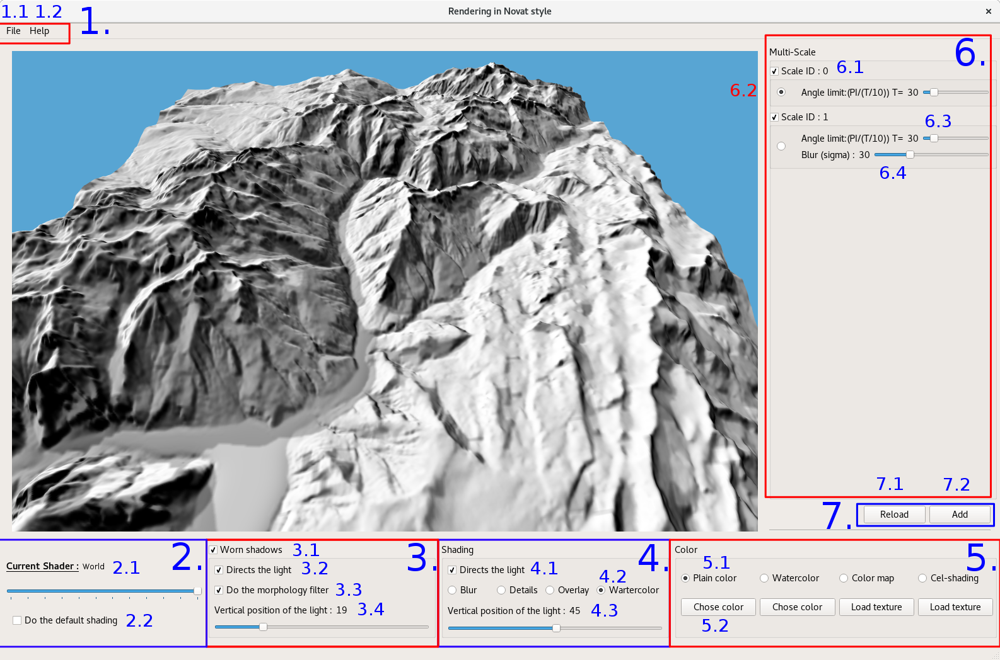

# Controls

The controls of the prototype.

## Mouse

* `Right`   Control the camera.
* `Middle`  Zoom.
* `Left`   Control the light.     

## Keyboard

* `r` Reload all shaders.
* `i` Set the camera to the initiale postion.
* `p` Print the camera and the light position in the terminal.
* `d` Fixe the camera and the light to a hard code positions (only work with the full "Alpe_d'huez_6_dalles" folder).
* `w` Switch to the previous draw mode.
* `x` Switch to the next draw mode.

## User interface

<ol>
<li> File menu.
<ol>
<li>Load DEM , save screenshot and quit the app.</li>
<li>Show help and about.</li>
</ol>
</li>
<li>Main control panel.
<ol>
<li>Select the draw mode (the current shader).</li>
<li> If check, do a classic shading instead of our shading method. </li>
</ol>
</li>
<li>Shadows control panel.
<ol>
<li> Enabled/Disabled shadows.</li>
<li> If enabled , the light for compute the shadow is locally directs with the slant.</li>
<li> If enabled , do the mathematical morphology filter.</li>
<li> Select the vertical position of the light (in degree) for compute the shadow.</li>
</ol>
</li>
<li>Shading control panel.
<ol>
<li> If enabled , the light for compute the shading is locally directs with the slant.</li>
<li> Select the merge method between two scales.</li>
<li> Select the vertical position of the light (in degree) for compute the shadow.</li>
</ol>
</li>
<li>Colorization control panel.
<ol>
<li> Select the colorization method.</li>
<li> Select the color or the texture for the method above.</li>
</ol>
</li>
<li>Mult-scale control panel.
<ol>
<li> Enabled or disabled a scale , the Laplacien pyramid is automatically updated.</li>
<li> Select the last scale of the Laplacien pyramid.</li>
<li> Select the threshold for directs the light for the scale (between pi/2 (T=20 )and pi/10 (T=100)).</li>
<li> Select blur factor for the current scale (Need to press button "Reload" after changing this setting).</li>
</ol>
</li>
<li>Multi-scale buttons.
<ol>
<li> Reload the Laplacien pyramid with the currents settings.</li>
<li> Add a new scale to the Laplacien pyramid.</li>
</ol>
</li>
</ol>
